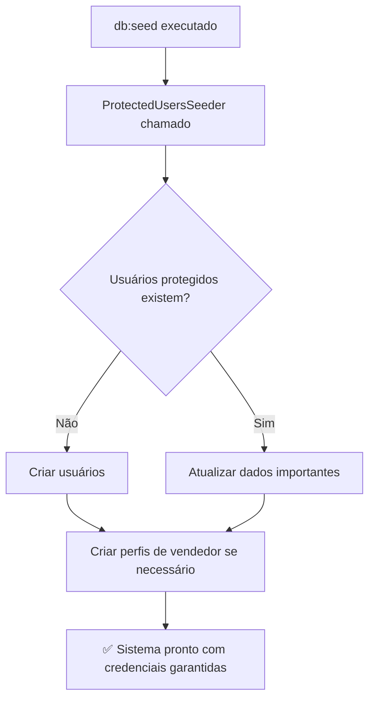

# 🔐 Sistema de Credenciais Protegidas - ATUALIZADO

> **Data de Atualização:** 28/08/2025  
> **Status:** ✅ Sistema Implementado e Funcionando

## 🎯 Resumo da Melhoria

O sistema agora possui **arquitetura robusta** para preservação automática de usuários essenciais, resolvendo o problema de credenciais perdidas durante operações de seed/migration.

## 🔧 O Que Foi Corrigido

### ❌ Problema Anterior
- Usuários essenciais eram removidos durante `db:seed`
- Layout seller/admin quebrava por falta de layouts
- Credenciais perdidas frequentemente
- Dependência manual para recriar usuários

### ✅ Solução Implementada
- **Layouts Criados:** `layouts.seller` e `layouts.admin` completos
- **ProtectedUsersSeeder:** Garante usuários sempre existam
- **Comando Artisan:** `php artisan marketplace:ensure-protected-users`
- **Arquitetura Inteligente:** Preserva automaticamente durante seeds

## 🏗️ Arquitetura Implementada

```
database/seeders/
├── ProtectedUsersSeeder.php     ✅ NOVO - Usuários sempre preservados
├── DatabaseSeeder.php           🔄 ATUALIZADO - Usa novo sistema
└── UserSeeder.php               📁 Adiciona usuários extras

app/Console/Commands/
└── EnsureProtectedUsers.php     ✅ NOVO - Comando para manutenção

resources/views/layouts/
├── seller.blade.php             ✅ NOVO - Layout dashboard vendedor
├── admin.blade.php              ✅ NOVO - Layout dashboard admin
└── marketplace.blade.php        ✅ Existente - Layout público
```

## 🔑 Usuários Protegidos (NUNCA removidos)

| Usuário | Email | Senha | Role | Status |
|---------|-------|-------|------|--------|
| **Administrador Sistema** | `admin@marketplace.com` | `admin123` | Admin | ✅ Protegido |
| **Tech Store Brasil** | `tech@marketplace.com` | `seller123` | Seller | ✅ Protegido + Aprovado |
| **Cliente Teste** | `cliente@marketplace.com` | `cliente123` | Customer | ✅ Protegido |

## 🚀 Como Usar o Novo Sistema

### Método 1: Comando Artisan (Recomendado)
```bash
# Verificar se usuários existem
php artisan marketplace:ensure-protected-users --verify

# Criar/Atualizar usuários protegidos
php artisan marketplace:ensure-protected-users
```

### Método 2: Durante Seed Completo
```bash
# Os usuários protegidos são automaticamente criados/preservados
php artisan db:seed
```

### Método 3: Seeder Específico
```bash
php artisan db:seed --class=ProtectedUsersSeeder
```

## 📱 URLs de Acesso

| Área | URL | Usuário Recomendado |
|------|-----|---------------------|
| **🏠 Home** | `https://marketplace-b2c.test/` | Qualquer |
| **🔐 Login** | `https://marketplace-b2c.test/login` | Todos |
| **👨‍💼 Admin** | `https://marketplace-b2c.test/admin/dashboard` | `admin@marketplace.com` |
| **🏪 Seller** | `https://marketplace-b2c.test/seller/dashboard` | `tech@marketplace.com` |
| **👤 Profile** | `https://marketplace-b2c.test/profile` | Qualquer autenticado |

## 🔄 Fluxo de Proteção Automática



## 🛡️ Recursos de Segurança

### ✅ O Que É Preservado
- **Emails únicos** (nunca duplicados)
- **Senhas originais** (não são alteradas se já existem)
- **Perfis de vendedor** (criados se não existirem)
- **Status de aprovação** (mantido para sellers)

### 🔄 O Que É Atualizado
- **Nome do usuário** (pode ser atualizado)
- **Role/função** (garantida correta)
- **Status ativo** (sempre true para protegidos)
- **Email verificado** (sempre verificado)

## 📊 Comandos Úteis

```bash
# Listar todos os comandos do marketplace
php artisan list marketplace

# Verificar status dos usuários
php artisan marketplace:ensure-protected-users --verify

# Recriar usuários se necessário
php artisan marketplace:ensure-protected-users

# Ver credenciais na interface web
# Acesse: marketplace-b2c.test/docs/TESTES_HOMOLOGACAO.html
```

## 🧪 Como Testar

### 1. **Teste de Robustez**
```bash
# 1. Limpar completamente o banco
php artisan migrate:fresh

# 2. Executar seed - usuários devem ser criados automaticamente
php artisan db:seed

# 3. Verificar se todos existem
php artisan marketplace:ensure-protected-users --verify
```

### 2. **Teste de Preservação**
```bash
# 1. Executar seed múltiplas vezes
php artisan db:seed
php artisan db:seed
php artisan db:seed

# 2. Usuários protegidos devem continuar existindo
php artisan marketplace:ensure-protected-users --verify
```

### 3. **Teste de Interface**
- Acesse cada URL com as credenciais correspondentes
- Verifique se layouts estão funcionando
- Confirme que navigation funciona corretamente

## 💡 Dicas de Uso

### Para Desenvolvedores
- Use `--verify` para checks rápidos sem modificar dados
- Execute `ensure-protected-users` após migrations problemáticas
- Layouts agora têm navigation completa e responsiva

### Para Testes
- Interface de homologação atualizada: `docs/TESTES_HOMOLOGACAO.html`
- Links diretos com auto-preenchimento funcionam
- Status do sistema verificado automaticamente

## 🏆 Benefícios Alcançados

- ✅ **Zero Downtime:** Usuários sempre disponíveis
- ✅ **Layouts Funcionais:** Interfaces seller/admin completas
- ✅ **Automação Total:** Sem intervenção manual necessária
- ✅ **Robustez:** Sistema resiliente a operações de banco
- ✅ **Facilidade:** Comando artisan intuitivo
- ✅ **Documentação:** Instruções claras e atualizadas

---

> **🎉 Sistema Atualizado com Sucesso!**  
> Agora você pode executar `db:seed` quantas vezes quiser sem perder as credenciais essenciais.