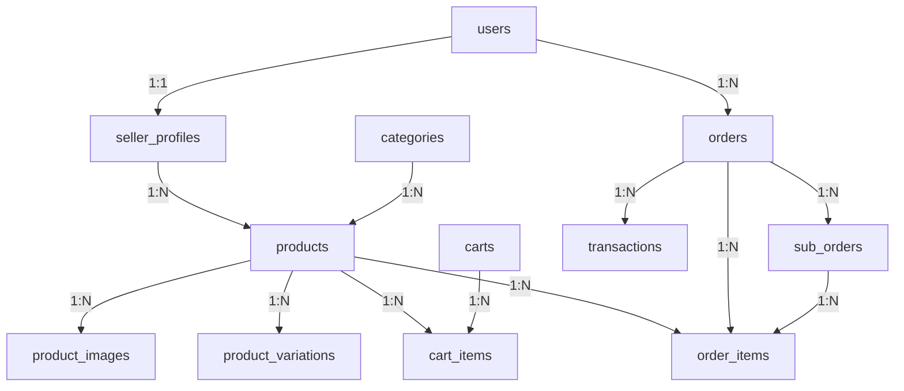

# 📊 DICIONÁRIO DE DADOS COMPLETO - MARKETPLACE B2C
> Última atualização: 31/08/2025
> ⚠️ **DOCUMENTO OFICIAL DE REFERÊNCIA PARA NOMENCLATURA DE CAMPOS**

## 📋 ÍNDICE
1. [Convenções de Nomenclatura](#convenções-de-nomenclatura)
2. [Tabelas Principais](#tabelas-principais)
3. [Relacionamentos](#relacionamentos)
4. [Enums e Constantes](#enums-e-constantes)
5. [Validações e Regras de Negócio](#validações-e-regras-de-negócio)

---

## 🔤 CONVENÇÕES DE NOMENCLATURA

### Padrões Gerais
- **IDs**: Sempre `id` (PK) e `{tabela}_id` (FK)
- **Timestamps**: `created_at`, `updated_at`, `deleted_at`
- **Status**: Usar campo `status` com valores ENUM
- **Booleanos**: Prefixo `is_`, `has_`, `can_`
- **Quantidades**: `{nome}_quantity` ou `{nome}_count`
- **Valores monetários**: `{nome}_price`, `{nome}_total`, `{nome}_fee`
- **Datas específicas**: `{ação}_at` (ex: approved_at, rejected_at)

---

## 📊 TABELAS PRINCIPAIS

### 1️⃣ **users**
Tabela de usuários do sistema

| Campo | Tipo | Null | Default | Descrição |
|-------|------|------|---------|-----------|
| **id** | bigint | NO | auto_increment | ID único do usuário |
| **name** | varchar(255) | NO | - | Nome completo |
| **email** | varchar(255) | NO | - | Email único |
| **email_verified_at** | timestamp | YES | NULL | Data de verificação do email |
| **password** | varchar(255) | NO | - | Senha criptografada |
| **role** | enum | NO | 'customer' | Papel: 'customer', 'seller', 'admin' |
| **two_factor_secret** | text | YES | NULL | Secret 2FA |
| **two_factor_recovery_codes** | text | YES | NULL | Códigos de recuperação 2FA |
| **two_factor_confirmed_at** | timestamp | YES | NULL | Confirmação 2FA |
| **remember_token** | varchar(100) | YES | NULL | Token de sessão |
| **current_team_id** | bigint | YES | NULL | Time atual (não usado) |
| **profile_photo_path** | varchar(2048) | YES | NULL | Caminho da foto de perfil |
| **created_at** | timestamp | YES | NULL | Data de criação |
| **updated_at** | timestamp | YES | NULL | Data de atualização |

### 2️⃣ **seller_profiles**
Perfis de vendedores

| Campo | Tipo | Null | Default | Descrição |
|-------|------|------|---------|-----------|
| **id** | bigint | NO | auto_increment | ID único do perfil |
| **user_id** | bigint | NO | - | FK -> users.id |
| **document_type** | enum | NO | 'CPF' | Tipo: 'CPF' ou 'CNPJ' |
| **document_number** | varchar(18) | NO | - | Número do documento |
| **company_name** | varchar(255) | NO | - | Nome da empresa/loja |
| **address_proof_path** | varchar(255) | YES | NULL | Comprovante de endereço |
| **identity_proof_path** | varchar(255) | YES | NULL | Documento de identidade |
| **phone** | varchar(20) | NO | - | Telefone principal |
| **address** | varchar(255) | NO | - | Endereço completo |
| **city** | varchar(100) | NO | - | Cidade |
| **state** | varchar(2) | NO | - | Estado (UF) |
| **postal_code** | varchar(10) | NO | - | CEP |
| **bank_name** | varchar(100) | YES | NULL | Nome do banco |
| **bank_agency** | varchar(10) | YES | NULL | Agência bancária |
| **bank_account** | varchar(20) | YES | NULL | Conta bancária |
| **status** | enum | NO | 'pending' | Status: 'pending', 'approved', 'rejected', 'suspended' |
| **rejection_reason** | text | YES | NULL | Motivo da rejeição |
| **commission_rate** | decimal(5,2) | NO | 10.00 | Taxa de comissão (%) |
| **product_limit** | int | NO | 100 | Limite de produtos |
| **mp_access_token** | text | YES | NULL | Token MercadoPago |
| **mp_user_id** | varchar(255) | YES | NULL | ID MercadoPago |
| **mp_connected** | boolean | NO | 0 | Conectado ao MP |
| **approved_at** | timestamp | YES | NULL | Data de aprovação |
| **approved_by** | bigint | YES | NULL | FK -> users.id (admin) |
| **rejected_at** | timestamp | YES | NULL | Data de rejeição |
| **rejected_by** | bigint | YES | NULL | FK -> users.id (admin) |
| **submitted_at** | timestamp | YES | NULL | Data de submissão |
| **created_at** | timestamp | YES | NULL | Data de criação |
| **updated_at** | timestamp | YES | NULL | Data de atualização |

### 3️⃣ **categories**
Categorias de produtos

| Campo | Tipo | Null | Default | Descrição |
|-------|------|------|---------|-----------|
| **id** | bigint | NO | auto_increment | ID único |
| **parent_id** | bigint | YES | NULL | FK -> categories.id (pai) |
| **name** | varchar(255) | NO | - | Nome da categoria |
| **slug** | varchar(255) | NO | - | Slug único para URL |
| **description** | text | YES | NULL | Descrição |
| **image_path** | varchar(255) | YES | NULL | Caminho da imagem |
| **icon** | varchar(50) | YES | NULL | Classe do ícone |
| **sort_order** | int | NO | 0 | Ordem de exibição |
| **is_active** | boolean | NO | 1 | Categoria ativa |
| **is_featured** | boolean | NO | 0 | Categoria em destaque |
| **meta_title** | varchar(255) | YES | NULL | SEO título |
| **meta_description** | text | YES | NULL | SEO descrição |
| **meta_keywords** | text | YES | NULL | SEO palavras-chave |
| **created_at** | timestamp | YES | NULL | Data de criação |
| **updated_at** | timestamp | YES | NULL | Data de atualização |

### 4️⃣ **products**
Produtos do marketplace

| Campo | Tipo | Null | Default | Descrição |
|-------|------|------|---------|-----------|
| **id** | bigint | NO | auto_increment | ID único |
| **seller_id** | bigint | NO | - | FK -> seller_profiles.id |
| **category_id** | bigint | NO | - | FK -> categories.id |
| **name** | varchar(255) | NO | - | Nome do produto |
| **slug** | varchar(255) | NO | - | Slug único para URL |
| **description** | text | NO | - | Descrição completa |
| **short_description** | text | YES | NULL | Descrição curta |
| **price** | decimal(10,2) | NO | - | Preço de venda |
| **compare_at_price** | decimal(10,2) | YES | NULL | Preço comparativo |
| **cost** | decimal(10,2) | YES | NULL | Custo do produto |
| **stock_quantity** | int | NO | 0 | Quantidade em estoque |
| **stock_status** | enum | NO | 'in_stock' | Status: 'in_stock', 'out_of_stock', 'limited' |
| **sku** | varchar(100) | YES | NULL | Código SKU |
| **barcode** | varchar(100) | YES | NULL | Código de barras |
| **weight** | decimal(8,3) | YES | NULL | Peso (kg) |
| **length** | decimal(8,2) | YES | NULL | Comprimento (cm) |
| **width** | decimal(8,2) | YES | NULL | Largura (cm) |
| **height** | decimal(8,2) | YES | NULL | Altura (cm) |
| **status** | enum | NO | 'draft' | Status: 'draft', 'active', 'inactive' |
| **featured** | boolean | NO | 0 | Produto em destaque |
| **digital** | boolean | NO | 0 | Produto digital |
| **downloadable_files** | json | YES | NULL | Arquivos para download |
| **meta_title** | varchar(255) | YES | NULL | SEO título |
| **meta_description** | text | YES | NULL | SEO descrição |
| **meta_keywords** | text | YES | NULL | SEO palavras-chave |
| **views_count** | int | NO | 0 | Contador de visualizações |
| **sales_count** | int | NO | 0 | Contador de vendas |
| **rating_average** | decimal(3,2) | NO | 0 | Média de avaliações |
| **rating_count** | int | NO | 0 | Quantidade de avaliações |
| **published_at** | timestamp | YES | NULL | Data de publicação |
| **brand** | varchar(100) | YES | NULL | Marca |
| **model** | varchar(100) | YES | NULL | Modelo |
| **warranty_months** | int | YES | NULL | Garantia em meses |
| **tags** | json | YES | NULL | Tags do produto |
| **attributes** | json | YES | NULL | Atributos extras |
| **dimensions** | json | YES | NULL | Dimensões detalhadas |
| **shipping_class** | varchar(50) | YES | NULL | Classe de envio |
| **created_at** | timestamp | YES | NULL | Data de criação |
| **updated_at** | timestamp | YES | NULL | Data de atualização |

### 5️⃣ **product_images**
Imagens dos produtos

| Campo | Tipo | Null | Default | Descrição |
|-------|------|------|---------|-----------|
| **id** | bigint | NO | auto_increment | ID único |
| **product_id** | bigint | NO | - | FK -> products.id |
| **original_name** | varchar(255) | NO | - | Nome original do arquivo |
| **file_name** | varchar(255) | NO | - | Nome do arquivo salvo |
| **file_path** | varchar(255) | NO | - | Caminho do arquivo |
| **thumbnail_path** | varchar(255) | YES | NULL | Caminho do thumbnail |
| **mime_type** | varchar(100) | NO | - | Tipo MIME |
| **file_size** | int | NO | - | Tamanho em bytes |
| **width** | int | YES | NULL | Largura em pixels |
| **height** | int | YES | NULL | Altura em pixels |
| **alt_text** | varchar(255) | YES | NULL | Texto alternativo |
| **title** | varchar(255) | YES | NULL | Título da imagem |
| **sort_order** | int | NO | 0 | Ordem de exibição |
| **is_primary** | boolean | NO | 0 | Imagem principal |
| **created_at** | timestamp | YES | NULL | Data de criação |
| **updated_at** | timestamp | YES | NULL | Data de atualização |

### 6️⃣ **carts**
Carrinhos de compras

| Campo | Tipo | Null | Default | Descrição |
|-------|------|------|---------|-----------|
| **id** | bigint | NO | auto_increment | ID único |
| **user_id** | bigint | YES | NULL | FK -> users.id (opcional) |
| **session_id** | varchar(255) | YES | NULL | ID da sessão |
| **total_amount** | decimal(10,2) | NO | 0 | Valor total |
| **expires_at** | timestamp | YES | NULL | Data de expiração |
| **created_at** | timestamp | YES | NULL | Data de criação |
| **updated_at** | timestamp | YES | NULL | Data de atualização |

### 7️⃣ **cart_items**
Itens do carrinho

| Campo | Tipo | Null | Default | Descrição |
|-------|------|------|---------|-----------|
| **id** | bigint | NO | auto_increment | ID único |
| **cart_id** | bigint | NO | - | FK -> carts.id |
| **product_id** | bigint | NO | - | FK -> products.id |
| **product_variation_id** | bigint | YES | NULL | FK -> product_variations.id |
| **quantity** | int | NO | - | Quantidade |
| **unit_price** | decimal(10,2) | NO | - | Preço unitário |
| **subtotal** | decimal(10,2) | NO | - | Subtotal |
| **created_at** | timestamp | YES | NULL | Data de criação |
| **updated_at** | timestamp | YES | NULL | Data de atualização |

### 8️⃣ **orders**
Pedidos principais

| Campo | Tipo | Null | Default | Descrição |
|-------|------|------|---------|-----------|
| **id** | bigint | NO | auto_increment | ID único |
| **user_id** | bigint | NO | - | FK -> users.id |
| **order_number** | varchar(50) | NO | - | Número único do pedido |
| **status** | enum | NO | 'pending' | Status do pedido |
| **payment_status** | enum | NO | 'pending' | Status do pagamento |
| **payment_method** | varchar(50) | YES | NULL | Método de pagamento |
| **subtotal** | decimal(10,2) | NO | - | Subtotal |
| **shipping_total** | decimal(10,2) | NO | 0 | Total do frete |
| **tax_total** | decimal(10,2) | NO | 0 | Total de impostos |
| **discount_total** | decimal(10,2) | NO | 0 | Total de descontos |
| **total** | decimal(10,2) | NO | - | Total geral |
| **coupon_code** | varchar(50) | YES | NULL | Código do cupom |
| **coupon_discount** | decimal(10,2) | NO | 0 | Desconto do cupom |
| **shipping_address** | json | YES | NULL | Endereço de entrega |
| **billing_address** | json | YES | NULL | Endereço de cobrança |
| **customer_notes** | text | YES | NULL | Observações do cliente |
| **admin_notes** | text | YES | NULL | Observações administrativas |
| **tracking_number** | varchar(255) | YES | NULL | Código de rastreamento |
| **shipped_at** | timestamp | YES | NULL | Data de envio |
| **delivered_at** | timestamp | YES | NULL | Data de entrega |
| **cancelled_at** | timestamp | YES | NULL | Data de cancelamento |
| **cancellation_reason** | text | YES | NULL | Motivo do cancelamento |
| **created_at** | timestamp | YES | NULL | Data de criação |
| **updated_at** | timestamp | YES | NULL | Data de atualização |

### 9️⃣ **order_items**
Itens dos pedidos

| Campo | Tipo | Null | Default | Descrição |
|-------|------|------|---------|-----------|
| **id** | bigint | NO | auto_increment | ID único |
| **order_id** | bigint | NO | - | FK -> orders.id |
| **product_id** | bigint | NO | - | FK -> products.id |
| **product_variation_id** | bigint | YES | NULL | FK -> product_variations.id |
| **seller_id** | bigint | NO | - | FK -> seller_profiles.id |
| **product_name** | varchar(255) | NO | - | Nome do produto (snapshot) |
| **product_sku** | varchar(100) | YES | NULL | SKU (snapshot) |
| **quantity** | int | NO | - | Quantidade |
| **unit_price** | decimal(10,2) | NO | - | Preço unitário |
| **subtotal** | decimal(10,2) | NO | - | Subtotal |
| **commission_rate** | decimal(5,2) | NO | - | Taxa de comissão |
| **commission_amount** | decimal(10,2) | NO | - | Valor da comissão |
| **seller_amount** | decimal(10,2) | NO | - | Valor do vendedor |
| **created_at** | timestamp | YES | NULL | Data de criação |
| **updated_at** | timestamp | YES | NULL | Data de atualização |

### 🔟 **sub_orders**
Sub-pedidos por vendedor

| Campo | Tipo | Null | Default | Descrição |
|-------|------|------|---------|-----------|
| **id** | bigint | NO | auto_increment | ID único |
| **order_id** | bigint | NO | - | FK -> orders.id |
| **seller_id** | bigint | NO | - | FK -> seller_profiles.id |
| **sub_order_number** | varchar(50) | NO | - | Número do sub-pedido |
| **status** | enum | NO | 'pending' | Status do sub-pedido |
| **subtotal** | decimal(10,2) | NO | - | Subtotal |
| **shipping_total** | decimal(10,2) | NO | 0 | Total do frete |
| **commission_total** | decimal(10,2) | NO | - | Total de comissão |
| **seller_total** | decimal(10,2) | NO | - | Total do vendedor |
| **tracking_number** | varchar(255) | YES | NULL | Código de rastreamento |
| **shipped_at** | timestamp | YES | NULL | Data de envio |
| **delivered_at** | timestamp | YES | NULL | Data de entrega |
| **created_at** | timestamp | YES | NULL | Data de criação |
| **updated_at** | timestamp | YES | NULL | Data de atualização |

### 1️⃣1️⃣ **transactions**
Transações financeiras

| Campo | Tipo | Null | Default | Descrição |
|-------|------|------|---------|-----------|
| **id** | bigint | NO | auto_increment | ID único |
| **order_id** | bigint | NO | - | FK -> orders.id |
| **sub_order_id** | bigint | YES | NULL | FK -> sub_orders.id |
| **user_id** | bigint | NO | - | FK -> users.id |
| **seller_id** | bigint | YES | NULL | FK -> seller_profiles.id |
| **type** | enum | NO | - | Tipo: 'payment', 'refund', 'commission', 'payout' |
| **status** | enum | NO | 'pending' | Status: 'pending', 'processing', 'completed', 'failed' |
| **amount** | decimal(10,2) | NO | - | Valor |
| **currency** | varchar(3) | NO | 'BRL' | Moeda |
| **payment_method** | varchar(50) | YES | NULL | Método de pagamento |
| **gateway** | varchar(50) | YES | NULL | Gateway de pagamento |
| **gateway_transaction_id** | varchar(255) | YES | NULL | ID da transação no gateway |
| **gateway_response** | json | YES | NULL | Resposta do gateway |
| **reference_number** | varchar(100) | YES | NULL | Número de referência |
| **description** | text | YES | NULL | Descrição |
| **metadata** | json | YES | NULL | Metadados extras |
| **processed_at** | timestamp | YES | NULL | Data de processamento |
| **failed_at** | timestamp | YES | NULL | Data de falha |
| **failure_reason** | text | YES | NULL | Motivo da falha |
| **created_at** | timestamp | YES | NULL | Data de criação |
| **updated_at** | timestamp | YES | NULL | Data de atualização |

---

## 🔗 RELACIONAMENTOS

### Relacionamentos Principais



### Chaves Estrangeiras

| Tabela | Campo | Referência | Cascade |
|--------|-------|------------|---------|
| seller_profiles | user_id | users.id | CASCADE |
| products | seller_id | seller_profiles.id | CASCADE |
| products | category_id | categories.id | RESTRICT |
| product_images | product_id | products.id | CASCADE |
| cart_items | cart_id | carts.id | CASCADE |
| cart_items | product_id | products.id | CASCADE |
| order_items | order_id | orders.id | CASCADE |
| order_items | product_id | products.id | RESTRICT |
| order_items | seller_id | seller_profiles.id | RESTRICT |
| sub_orders | order_id | orders.id | CASCADE |
| sub_orders | seller_id | seller_profiles.id | RESTRICT |
| transactions | order_id | orders.id | CASCADE |
| transactions | sub_order_id | sub_orders.id | SET NULL |
| transactions | user_id | users.id | RESTRICT |
| transactions | seller_id | seller_profiles.id | SET NULL |

---

## 📝 ENUMS E CONSTANTES

### User Roles
```php
'customer' // Cliente padrão
'seller'   // Vendedor
'admin'    // Administrador
```

### Seller Profile Status
```php
'pending'   // Aguardando aprovação
'approved'  // Aprovado
'rejected'  // Rejeitado
'suspended' // Suspenso
```

### Product Status
```php
'draft'    // Rascunho
'active'   // Ativo (visível na loja)
'inactive' // Inativo (oculto)
```

### Stock Status
```php
'in_stock'     // Em estoque
'out_of_stock' // Sem estoque
'limited'      // Estoque limitado
```

### Order Status
```php
'pending'     // Pendente
'processing'  // Processando
'shipped'     // Enviado
'delivered'   // Entregue
'cancelled'   // Cancelado
'refunded'    // Reembolsado
```

### Payment Status
```php
'pending'    // Pendente
'paid'       // Pago
'failed'     // Falhou
'refunded'   // Reembolsado
'partially'  // Parcialmente pago
```

### Transaction Type
```php
'payment'    // Pagamento
'refund'     // Reembolso
'commission' // Comissão
'payout'     // Repasse
```

### Transaction Status
```php
'pending'    // Pendente
'processing' // Processando
'completed'  // Completado
'failed'     // Falhou
```

---

## ✅ VALIDAÇÕES E REGRAS DE NEGÓCIO

### Produtos
- **stock_quantity**: Mínimo 0
- **price**: Mínimo 0.01
- **commission_rate**: Entre 0 e 100
- **slug**: Único por tabela
- **status**: Apenas 'active' aparece na loja
- **featured**: Boolean (0 ou 1)

### Vendedores
- **document_number**: CPF (11 dígitos) ou CNPJ (14 dígitos)
- **commission_rate**: Padrão 10%, máximo 50%
- **product_limit**: Padrão 100 produtos
- **state**: Apenas UF válidas (2 caracteres)
- **postal_code**: Formato XXXXX-XXX

### Pedidos
- **order_number**: Formato: ORD-YYYYMMDD-XXXXX
- **sub_order_number**: Formato: SUB-YYYYMMDD-XXXXX
- **total**: Soma de subtotal + shipping - discount
- **commission_amount**: price * commission_rate / 100
- **seller_amount**: subtotal - commission_amount

### Imagens
- **Formatos aceitos**: jpg, jpeg, png, webp
- **Tamanho máximo**: 5MB
- **Dimensões mínimas**: 400x400px
- **Máximo por produto**: 10 imagens
- **is_primary**: Apenas 1 por produto

### Carrinho
- **expires_at**: 30 dias após última atualização
- **session_id**: Obrigatório se user_id é NULL
- **quantity**: Mínimo 1

---

## 🔍 ÍNDICES IMPORTANTES

### Índices de Performance
- products: `(seller_id, status, stock_quantity)`
- products: `(category_id, status, featured)`
- products: `(slug)` - UNIQUE
- orders: `(user_id, status)`
- orders: `(order_number)` - UNIQUE
- sub_orders: `(seller_id, status)`
- transactions: `(gateway_transaction_id)`

### Índices de Busca
- products: `FULLTEXT(name, description)`
- categories: `(slug)` - UNIQUE
- users: `(email)` - UNIQUE

---

## 📌 OBSERVAÇÕES IMPORTANTES

1. **NUNCA usar campos is_active para produtos** - Usar campo `status` com valores 'active', 'draft', 'inactive'
2. **seller_id refere-se a seller_profiles.id**, não users.id
3. **Todos os valores monetários** usar DECIMAL(10,2)
4. **Timestamps** sempre nullable com default NULL
5. **Campos JSON** para dados estruturados variáveis
6. **product_limit** é por seller_profile, não por user
7. **commission_rate** é percentual (10.00 = 10%)

---

## 🚨 CAMPOS CRÍTICOS QUE CAUSAM ERROS COMUNS

| ❌ ERRADO | ✅ CORRETO | Contexto |
|-----------|------------|----------|
| `store_id` | `seller_id` | Em products |
| `store_name` | `company_name` | Em seller_profiles |
| `is_active` | `status` | Em products |
| `quantity` | `stock_quantity` | Em products |
| `seller_profile_id` | `seller_id` | Em products |
| `shipping_cost` | `shipping_total` | Em orders |
| `Store` model | `SellerProfile` model | No Laravel |

---

## 📅 CONTROLE DE VERSÃO

| Versão | Data | Alterações |
|--------|------|------------|
| 1.0 | 31/08/2025 | Documento inicial completo |

---

**⚠️ ESTE É O DOCUMENTO OFICIAL - SEMPRE CONSULTE ANTES DE CRIAR OU MODIFICAR CÓDIGO**